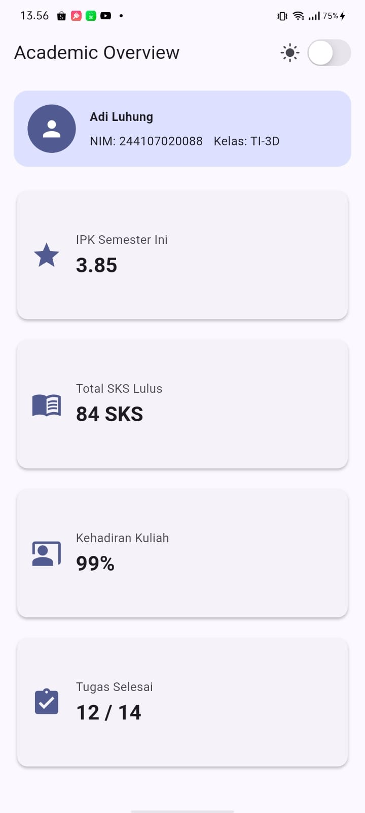
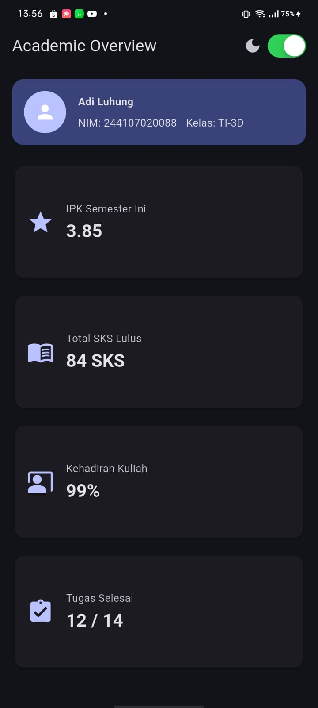
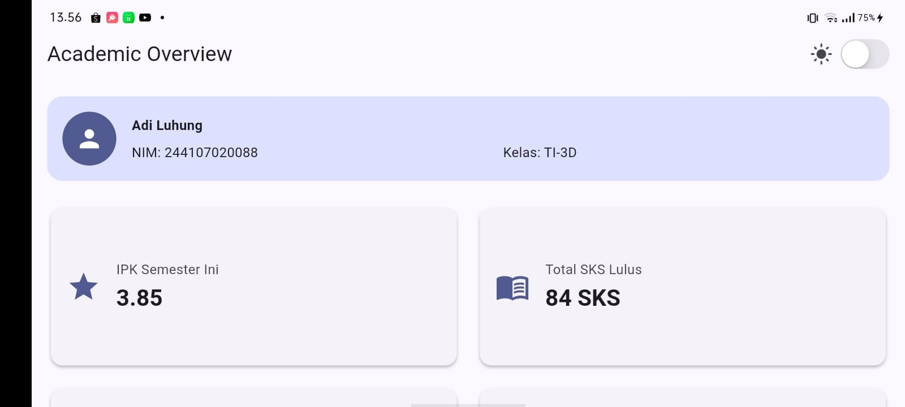
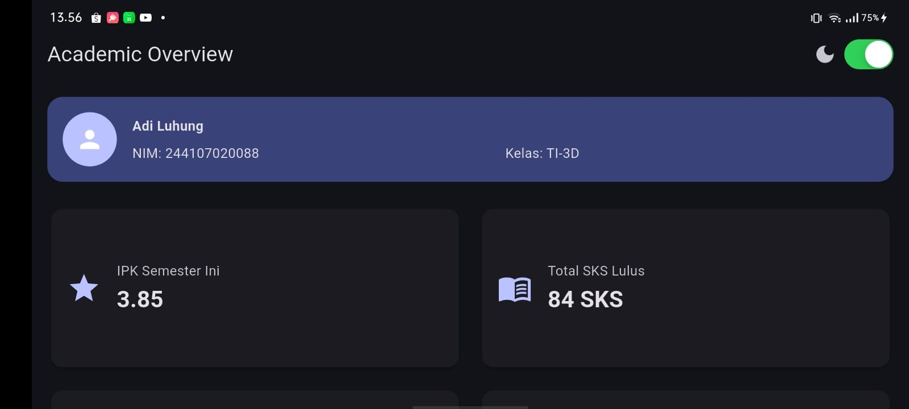

# Declarative UI & Responsive Design - Academic Overview

Tugas Mingguan Pemrograman Mobile - Week 2. Aplikasi ini merupakan halaman *Academic Overview* mahasiswa yang responsif, mendukung aksesibilitas (*accessibility*), serta memiliki fitur peralihan tema dinamis (Dark/Light Mode).

---

## Fitur Utama Aplikasi
* **Header Profil:** Menampilkan ringkasan data mahasiswa (Nama, NIM, Kelas) menggunakan kombinasi `Row`, `Column`, `Expanded`, dan `Container`.
* **Layout Responsif:** Otomatis mengubah tampilan menjadi **1 kolom pada layar sempit** (< 700px) dan **2 kolom pada layar lebar** (>= 700px) melalui implementasi `LayoutBuilder` dan `GridView`.
* **Toggle Tema Dinamis:** Menggunakan `CupertinoSwitch` untuk mengubah tema secara instan antara mode terang dan mode gelap secara konsisten.
* **Aksesibilitas Tinggi:** Dilengkapi komponen `Semantics` pada elemen penting agar dapat dibaca dengan baik oleh *screen reader*.

---

## Dokumentasi Screenshot Aplikasi

### 1. Tampilan Layar Sempit (HP)

| Mode Terang (Light Mode) | Mode Gelap (Dark Mode) |
| :---: | :---: |
|  |  |

### 2. Tampilan Layar Lebar (Tablet / Landscape)

| Mode Terang (Light Mode) | Mode Gelap (Dark Mode) |
| :---: | :---: |
|  |  |

---

## Hasil Refactoring Challenge
Kode aplikasi telah dioptimalkan dengan standar kebersihan kode berikut:
1. **Reusable Widget:** Mengekstrak komponen kartu informasi menjadi widget `InfoCard` yang mandiri agar terhindar dari duplikasi kode.
2. **Dynamic Theming:** Menghapus warna dan ukuran yang di-*hardcode*, diganti menggunakan properti global `Theme.of(context)` agar transisi warna berjalan mulus secara otomatis.
3. **Konstanta Breakpoint:** Memindahkan angka batasan lebar layar ke variabel konstanta global `const double kWideBreakpoint = 700.0;`.
4. **Analisis Statis:** Kode bersih dan bebas dari error maupun warning baru saat dijalankan perintah `flutter analyze`.

---

## Hasil Pengujian (Testing)
Aplikasi telah lolos pengujian fungsionalitas responsif secara otomatis menggunakan Widget Test.

**Perintah Pengujian:**
```bash
flutter test
```

**Output Pengujian:**


---

## AI Prompt Challenge Documentation

### 1. Perbandingan LayoutBuilder + Column vs GridView
* **GridView (Dipilih):** Sangat efisien untuk menyusun banyak item berskala seragam. GridView otomatis mengatur susunan petak secara efisien, menghemat penulisan baris baris kode manual, dan lebih ramah aksesibilitas untuk pembaca layar karena posisinya berurutan di dalam satu kesatuan kontainer.
* **LayoutBuilder + Column:** Memberikan kontrol kustomisasi tata letak yang sangat presisi per piksel, tetapi memerlukan kalkulasi matematika manual yang rumit untuk membagi porsi lebar item, sehingga rawan memicu masalah *overflow* pada perangkat beresolusi rendah.

### 2. Analisis Kasus Overflow pada Penggunaan Expanded
Widget `Expanded` dirancang untuk memaksa anaknya mengambil ruang kosong yang tersisa di dalam komponen fleksibel (`Row`, `Column`, atau `Flex`). 
* **Penyebab Kegagalan:** Jika `Expanded` diletakkan di dalam widget yang tidak membatasi ruang vertikal/horizontal (seperti di dalam `ListView` vertikal tanpa tinggi statis, atau di dalam `Column` yang bersarang), Flutter akan kebingungan menghitung batas ruang kosong. Hal ini memicu error fatal berupa *unbounded constraints* atau *renderbox overflow*.
* **Solusi Perbaikan:** Selalu pastikan `Expanded` diletakkan langsung sebagai anak dari komponen yang berdimensi tegas, atau bungkus komponen bersarang dengan `SizedBox` yang mendefinisikan tinggi/lebar tetap terlebih dahulu.

### 3. Hasil Verifikasi Mandiri (Self-Audit)
* **Keterbacaan di bawah 600px:** Sangat aman. Ketika layar di bawah 700px, sistem otomatis melipat tampilan menjadi 1 kolom penuh ke bawah, sehingga teks di dalam kartu tidak terpotong dan tetap nyaman dibaca pada layar sekecil 320px sekalipun.
* **Status Widget:** Seluruh widget yang digunakan (`LayoutBuilder`, `CupertinoSwitch`, `GridView`, `Semantics`) menggunakan pustaka Flutter Stabil versi terbaru dan tidak ada yang berstatus *deprecated* atau eksperimental.

---

## Refleksi Pembelajaran

Melalui praktikum minggu ke-2 ini, ada beberapa pelajaran penting yang didapatkan dalam membuat tampilan aplikasi:

* **Cara Kerja Declarative UI:** 
  Ada perbedaan besar antara cara lama (*imperative*) dan cara Flutter (*declarative*). Di Flutter, tampilan layar dibuat berdasarkan kondisi data atau *state*. Ketika data tersebut berubah—misalnya saat tombol switch tema ditekan—Flutter akan otomatis menggambar ulang tampilan layar yang berubah. Hal ini membuat proses pengodean menjadi jauh lebih ringkas dan rapi.

* **Aturan Memasang Widget Expanded:** 
  Widget `Expanded` sangat berguna untuk membagi sisa ruang layar dan mencegah teks terpotong (*overflow*), seperti pada baris NIM dan Kelas. Namun, widget ini tidak bisa dipasang sembarangan. Jika `Expanded` ditaruh di dalam wadah yang ukurannya tidak pasti (seperti di dalam `ListView` atau `Column` yang bertumpuk), aplikasi akan mengalami error karena sistem bingung menghitung luas layar. Solusinya, wadah tersebut harus diberi ukuran tinggi atau lebar yang jelas terlebih dahulu.

* **Manfaat Breakpoint dan Tema:** 
  Penggunaan batas ukuran layar (*breakpoint* 700px) sangat penting agar aplikasi tidak berantakan saat dibuka di HP maupun tablet. Tampilan otomatis berubah menjadi 1 kolom di HP supaya teks tidak berdesakan, dan melebar menjadi 2 kolom di tablet agar ruang layar tidak kosong. Fitur *dark mode* juga sangat membantu menjaga kenyamanan mata pengguna agar tidak cepat lelah saat membuka aplikasi di tempat yang gelap.

